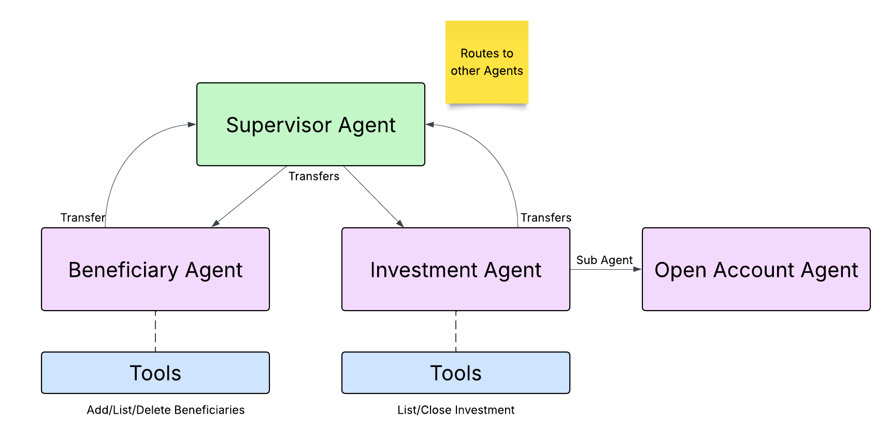

# Wealth Management Agent Example using Google ADK
Demonstrates how to use [Google ADK](https://adk.dev/) using subagents and instructions to delegate to other agents. 
Shows an example of just using the Google ADK and another version that leverages [Temporal](https://temporal.io) to 
wrap the agentic flow with Temporal and make it durable. 



The vanilla Google ADK version of this example is located [here](src/adk_supervisor/README.md).
The Temporal version of this example is located [here](src/temporal_supervisor/README.md).

Scenarios currently implemented include
* Add Beneficiary - add a new beneficiary to your account
* List Beneficiaries - shows a list of beneficiaries and their relationship to the account owner
* Delete Beneficiary - delete a beneficiary from your account
* Open Investment Account - opens a new investment account - using a **child workflow** in the Temporal version. 
* List Investments - shows a list of accounts and their current balances
* Close Investment Account - closes an investment account

You can run through the scenarios with the Temporal version using a [Web Application](src/frontend/README.md) or

## Prerequisites

* [uv](https://docs.astral.sh/uv/) - Python package and project manager
* [Google / Gemini Key](https://console.cloud.google.com/apis/credentials) or [AI Studio](https://aistudio.google.com/api-keys) - Your key to access Gemini models
* [Temporal CLI](https://docs.temporal.io/cli#install) - Local Temporal service
* [Redis](https://redis.io/downloads/) - Stores conversation history

## Set up Python Environment
```bash
uv sync
```

## Set up your Gemini API Key
 
```bash
cp setgeminikey.example setgeminikey.sh
chmod +x setoaikey.sh
```

Now edit the setgeminikey.sh file and paste in your Gemini API Key.
It should look something like this:
```text
export GEMINI_API_KEY="Your API Key Goes Here"
```

## Getting Started

See the Gemini ADK Version [here](src/adk_supervisor/README.md)
And the Temporal version of this example is located [here](src/temporal_supervisor/README.md)
